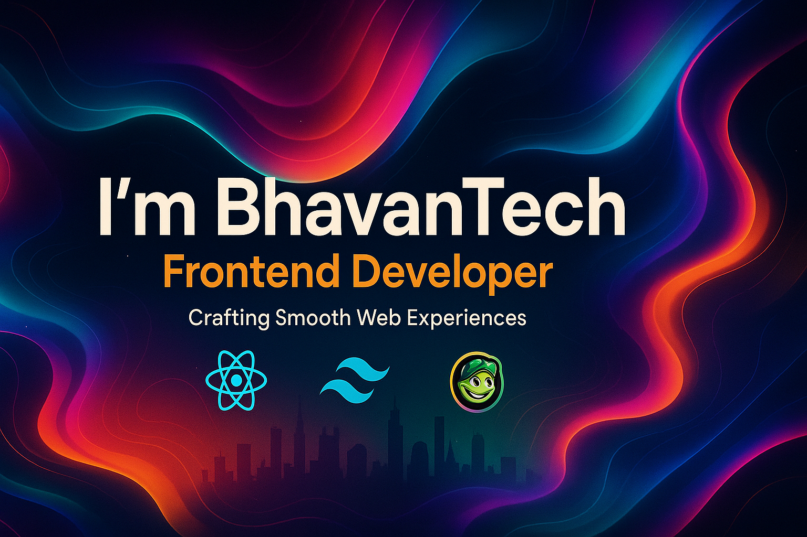

<!---
BhavanTech/BhavanTech is a ✨ special ✨ repository because its README.md (this file) appears on your GitHub profile.
--->

<!-- Banner -->

  

# 👋 Hi, I'm Bhavan Patil  
### 🚀 Frontend Developer | JavaScript Enthusiast

I'm a *Frontend Developer* focused on building sleek, responsive, and animated web experiences.  
Passionate about *React, Tailwind CSS, GSAP,* and crafting modern UIs with smooth scroll and interactions using **Lenis** and **GSAP**.

---

## 📌 *About Me*
- 🧠 *Engineering Graduate (EXTC) from Atharva College of Engineering*
- 🛠️ *Love building real-world projects (like real estate websites, studio portfolios)*
- 🌟 *Currently experimenting with scroll-based effects and animation workflows*
- 📱 *Optimizing everything for mobile — mobile menus, responsive layouts & more*
- 🎯 *Goal: To create immersive frontend experiences with cutting-edge web tech*

---

## 🛠 *Tech Stack*

### 💻 *Languages & Frameworks*

### 🧰 *Tools & Platforms*

---

## 📊 *GitHub Stats*

  
  
  
  

---

## 🔗 *Connect with Me*
📫 Email: [patilbhavan123@gmail.com](mailto:patilbhavan123@gmail.com)  
💼 LinkedIn: [Bhavan Sandeep Patil](https://www.linkedin.com/in/bhavan-patil-2a18762ab)  
🐙 GitHub: [BhavanTech](https://github.com/BhavanTech)

---

### 🎨 *Fun Fact*
✨ I'm obsessed with adding scroll-based effects, parallax vibes, and animations that make websites feel alive!  
Always exploring ways to blend UI/UX with storytelling through motion.

---

<!--
**BhavanTech/BhavanTech** is a ✨ _special_ ✨ repository because its `README.md` (this file) appears on your GitHub profile.

Here are some ideas to get you started:

- 🔭 I’m currently working on ...
- 🌱 I’m currently learning ...
- 👯 I’m looking to collaborate on ...
- 🤔 I’m looking for help with ...
- 💬 Ask me about ...
- 📫 How to reach me: ...
- 😄 Pronouns: ...
- ⚡ Fun fact: ...
-->
