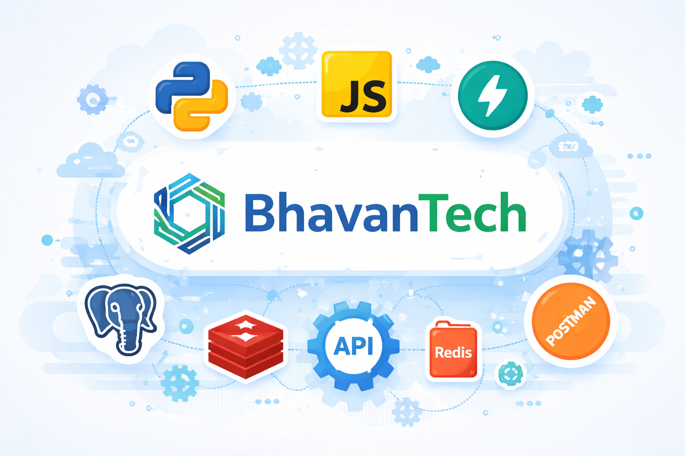

<!---
BhavanTech/BhavanTech is a ✨ special ✨ repository because its README.md (this file) appears on your GitHub profile.
--->

<!-- Banner -->

 
   

# 👋 Hi, I'm Bhavan Patil  
### 🚀 Software Developer | Full Stack Engineer | React • FastAPI • Scalable Systems

I'm a Software Developer passionate about building scalable, high-performance applications with clean architecture and efficient code.  

I work across both frontend and backend, using technologies like React, FastAPI, and PostgreSQL to develop full-stack solutions. I enjoy solving real-world problems, optimizing performance, and creating seamless user experiences.  

With a strong foundation in JavaScript and Python, I focus on writing maintainable code and continuously improving my problem-solving and system design skills.  

Currently exploring advanced full-stack development, backend optimization, and modern web architectures.

---

## 📌 *About Me*
- 🧠 *Engineering Graduate (EXTC) from Atharva College of Engineering*
- 🚀 Software Developer with strong foundations in JavaScript & Python
- 🌐 Building full-stack applications using React, FastAPI, PostgreSQL
- ⚡ Focused on performance, scalability, and clean architecture
- 🎯 Passionate about solving real-world problems through code
- 📈 Continuously improving DSA, system design, and backend skills

---

## 🛠 *Tech Stack*

### 💻 Languages & Frameworks

  

### 🗄️ Database & Tools

  

---

## 📊 *GitHub Stats*

 
   
   
   
   

---

## 🔗 *Connect with Me*
📫 Email: [patilbhavan123@gmail.com](mailto:patilbhavan123@gmail.com)  
💼 LinkedIn: [Bhavan Sandeep Patil](https://www.linkedin.com/in/bhavan-patil-2a18762ab)  
🐙 GitHub: [BhavanTech](https://github.com/BhavanTech)

---

### 🎨 *Fun Fact*
✨ I enjoy turning complex problems into simple, scalable solutions and love optimizing applications for performance and efficiency.

---

<!--
**BhavanTech/BhavanTech** is a ✨ _special_ ✨ repository because its `README.md` (this file) appears on your GitHub profile.

Here are some ideas to get you started:

- 🔭 I’m currently working on ...
- 🌱 I’m currently learning ...
- 👯 I’m looking to collaborate on ...
- 🤔 I’m looking for help with ...
- 💬 Ask me about ...
- 📫 How to reach me: ...
- 😄 Pronouns: ...
- ⚡ Fun fact: ...
-->
